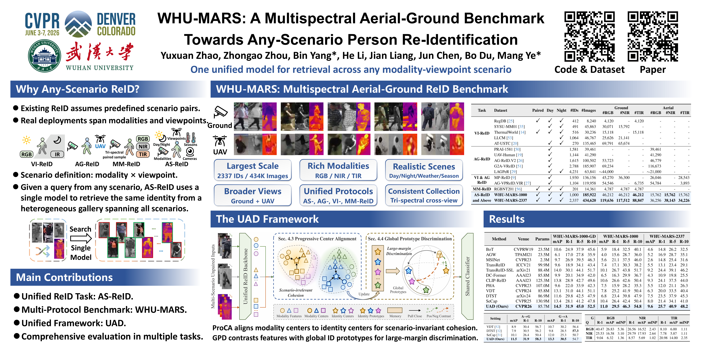
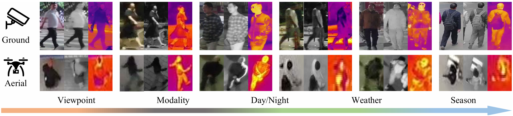
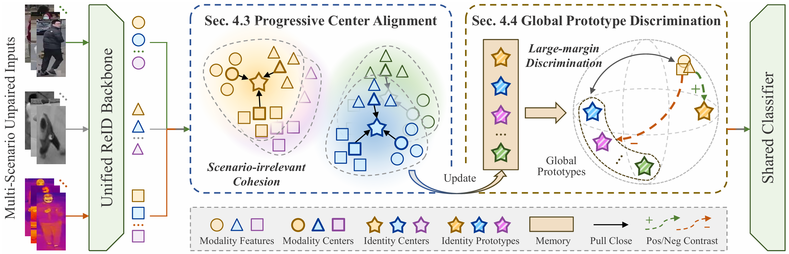

<h1 align="center">WHU-MARS: A Multispectral Aerial-Ground Benchmark Towards Any-Scenario Person Re-Identification</h1>
<h3 align="center">Yuxuan Zhao, Zhongao Zhou, Bin Yang, He Li, Jian Liang, Jun Chen, Bo Du, Mang Ye</h3>
<h3 align="center">CVPR 2026 (Highlight)</h3>



Welcome to the official repository of our paper **"WHU-MARS: A Multispectral Aerial-Ground Benchmark Towards Any-Scenario Person Re-Identification"**.

## Any-Scenario ReID

We formulate **Any-Scenario Person ReID (AS-ReID)** as a unified retrieval task. Given a query from any scenario, the model searches for the same identity in a gallery containing images from all available scenarios.

A scenario is defined as a combination of:

- modality: RGB, NIR, TIR
- viewpoint: ground, aerial

Unlike previous task-specific settings, AS-ReID uses one unified model for any-to-any retrieval.

## WHU-MARS Dataset

**WHU-MARS** is a large-scale multispectral aerial-ground benchmark, containing 2,337 IDs and 434,620 images captured by RGB, NIR, TIR on both ground and UAV platforms. WHU-MARS covers day and night, multiple seasons, diverse weather conditions, introducing realistic variations in illumination, viewpoint, scale, and spectral appearance that reflect realworld diversity. It supports unified training and evaluation for AS-ReID, while remaining compatible with conventional AG-ReID, VI-ReID, and MM-ReID protocols.

The WHU-MARS dataset is available for non-commercial academic research only. To request access, please complete the [Agreement](./WHU-MARS_Agreement.pdf) and send the signed copy to [zhaoyuxuan@whu.edu.cn](mailto:zhaoyuxuan@whu.edu.cn). Approved applicants will receive the dataset download link by email. Please do not redistribute the dataset or share the download link with others.



| Task             | Dataset                                                      | Paired | Day  | Night |  #IDs |     #Images | Ground #RGB | Ground #NIR | Ground #TIR | Aerial #RGB | Aerial #NIR | Aerial #TIR |
| ---------------- | ------------------------------------------------------------ | ------ | ---- | ----- | ----: | ----------: | ----------: | ----------: | ----------: | ----------: | ----------: | ----------: |
| **VI**           | [RegDB](https://doi.org/10.3390/s17030605)                   | ✓      | ✓    | ✓     |   412 |       8,240 |       4,120 |           - |       4,120 |           - |           - |           - |
| **VI**           | [SYSU-MM01](https://github.com/wuancong/SYSU-MM01)           |        | ✓    | ✓     |   491 |      45,863 |      30,071 |      15,792 |           - |           - |           - |           - |
| **VI**           | [ThermalWorld](https://github.com/vlkniaz/ThermalGAN)        | ✓      | ✓    | ✓     |   516 |      30,236 |      15,118 |           - |      15,118 |           - |           - |           - |
| **VI**           | [LLCM](https://github.com/ZYK100/LLCM)                       |        |      | ✓     | 1,064 |      46,767 |      25,626 |      21,141 |           - |           - |           - |           - |
| **VI**           | [AT-USTC](https://github.com/kw66/AT-ReID)                   |        | ✓    | ✓     |   270 |     135,465 |      69,791 |      65,674 |           - |           - |           - |           - |
| **AG**           | [PRAI-1581](https://github.com/stormyoung/PRAI-1581)         |        | ✓    |       | 1,581 |      39,461 |           - |           - |           - |      39,461 |           - |           - |
| **AG**           | [UAV-Human](https://github.com/SUTDCV/UAV-Human)             |        | ✓    |       | 1,144 |      41,290 |           - |           - |           - |      41,290 |           - |           - |
| **AG**           | [AG-ReID.V2](https://github.com/huynguyen792/AG-ReID.v2)     |        | ✓    |       | 1,615 |     100,502 |      53,723 |           - |           - |      46,779 |           - |           - |
| **AG**           | [G2A-VReID](https://github.com/FHR-L/G2A-VReID)              |        | ✓    |       | 2,788 |     185,907 |      69,234 |           - |           - |     116,673 |           - |           - |
| **AG**           | [LAGPeR](https://github.com/wangshining681/SeCap-AGPReID)    |        | ✓    | ✓     | 4,231 |      63,841 |     ~44,000 |           - |           - |     ~21,000 |           - |           - |
| **VI & AG**      | [MP-ReID](https://github.com/MP-ReID/mp-reid)                |        | ✓    |       | 1,930 |     136,156 |      45,270 |      36,300 |           - |      26,046 |           - |      28,543 |
| **VI & AG**      | [AG-VPReID.VIR](https://github.com/agvpreid25/AG-VPReID.VIR) |        | ✓    |       | 1,104 |     119,958 |      54,546 |           - |       6,735 |      54,784 |           - |       3,893 |
| **MM**           | [RGBNT201](https://ojs.aaai.org/index.php/AAAI/article/view/16467) | ✓      | ✓    | ✓     |   201 |      14,361 |       4,787 |       4,787 |       4,787 |           - |           - |           - |
| **AS and Above** | **WHU-MARS**                                                 | ✓      | ✓    | ✓     | 1,000 | **185,922** |      46,212 |      46,212 |  **46,212** |      15,762 |  **15,762** |      15,762 |
| **AS and Above** | **WHU-MARS-2337**                                            | ✓      | ✓    | ✓     | 2,337 | **434,620** | **119,636** | **117,512** |  **88,847** |      36,256 |  **38,143** |  **34,226** |

## UAD Framework

We propose **Unified Alignment and Discrimination (UAD)** to learn scenario-invariant and discriminative representations with a single model. The code is available in [CVPR26_UAD](./CVPR26_UAD)

UAD contains two key components:

- **Progressive Center Alignment (ProCA)**  :ProCA first aggregates multi-view features into modality centers, then aligns modality centers toward identity centers. This reduces scenario bias and improves intra-identity cohesion.

- **Global Prototype Discrimination (GPD)**  :GPD maintains global identity prototypes and contrasts each sample against all identity prototypes. This improves inter-identity discrimination under large heterogeneous galleries.



## Experiments

| Method | Venue | Params | mAP | R-1 | R-5 | R-10 | mAP | R-1 | R-5 | R-10 | mAP | R-1 | R-5 | R-10 |
|---|---|---:|---:|---:|---:|---:|---:|---:|---:|---:|---:|---:|---:|---:|
| [BoT](https://github.com/michuanhaohao/reid-strong-baseline) | CVPRW19 | 23.5M | 10.6 | 24.9 | 37.9 | 45.6 | 5.9 | 18.4 | 32.5 | 40.1 | 4.6 | 14.8 | 26.2 | 32.5 |
| [AGW](https://github.com/mangye16/Cross-Modal-Re-ID-baseline) | TPAMI21 | 23.5M | 6.1 | 17.0 | 27.8 | 35.9 | 4.0 | 15.6 | 28.7 | 36.0 | 5.2 | 16.9 | 28.7 | 35.1 |
| [MSINet](https://github.com/vimar-gu/MSINet) | CVPR23 | 2.3M | 9.7 | 26.9 | 39.5 | 46.3 | 5.6 | 21.1 | 37.5 | 46.0 | 2.6 | 14.8 | 25.4 | 31.6 |
| [TransReID](https://github.com/damo-cv/TransReID) | ICCV21 | 99.9M | 9.6 | 18.9 | 34.1 | 43.4 | 7.4 | 17.1 | 30.3 | 38.2 | 5.5 | 13.1 | 23.4 | 29.1 |
| [TransReID-SSL](https://github.com/damo-cv/TransReID-SSL) | arXiv21 | 88.4M | 14.0 | 30.1 | 44.1 | 51.7 | 10.1 | 26.7 | 43.8 | 51.7 | 9.2 | 24.4 | 39.1 | 46.2 |
| [DC-Former](https://github.com/alipay/Diverse-and-Compact-Transformer) | AAAI23 | 85.8M | 9.9 | 20.1 | 34.9 | 42.0 | 6.5 | 16.3 | 29.9 | 36.7 | 4.3 | 10.9 | 19.8 | 25.5 |
| [CLIP-ReID](https://github.com/Syliz517/CLIP-ReID) | AAAI23 | 125.3M | 13.8 | 28.9 | 42.7 | 49.6 | 10.6 | 26.6 | 42.6 | 50.4 | 9.3 | 24.1 | 37.5 | 44.0 |
| [PHA](https://github.com/zhangguiwei610/PHA) | CVPR23 | 107.0M | 9.6 | 22.0 | 33.9 | 42.3 | 7.5 | 15.9 | 28.2 | 35.3 | 5.5 | 12.0 | 21.1 | 26.3 |
| [VDT](https://github.com/LinlyAC/VDT-AGPReID) | CVPR24 | 85.8M | 13.1 | 31.0 | 44.1 | 51.1 | 7.8 | 25.2 | 41.9 | 50.4 | 6.3 | 20.0 | 33.5 | 40.4 |
| [DTST](https://yuhaiw.github.io/DTS-AGPReID/) | arXiv24 | 86.9M | 11.6 | 29.8 | 42.5 | 47.9 | 6.8 | 23.4 | 39.8 | 47.9 | 7.5 | 23.5 | 37.9 | 45.3 |
| [SeCap](https://github.com/wangshining681/SeCap-AGPReID) | CVPR25 | 130.9M | 13.4 | 28.1 | 41.2 | 47.8 | 10.4 | 26.4 | 42.4 | 50.4 | 8.0 | 21.4 | 34.1 | 41.0 |
| **UAD (Ours)** | **CVPR26** | 85.7M | **14.5** | **31.9** | **45.0** | **52.5** | **11.0** | **29.5** | **46.3** | **54.8** | **9.6** | **25.7** | **40.9** | **48.2** |

## Citation

If you find this project useful, please cite our paper:

```bibtex
@inproceedings{zhao2026whumars,
  title     = {WHU-MARS: A Multispectral Aerial-Ground Benchmark Towards Any-Scenario Person Re-Identification},
  author    = {Zhao, Yuxuan and Zhou, Zhongao and Yang, Bin and Li, He and Liang, Jian and Chen, Jun and Du, Bo and Ye, Mang},
  booktitle = {Proceedings of the IEEE/CVF Conference on Computer Vision and Pattern Recognition},
  year      = {2026}
}
```

## Contact

If you have any questions or suggestions, feel free to open an issue or contact me at [zhaoyuxuan@whu.edu.cn](mailto:zhaoyuxuan@whu.edu.cn).
